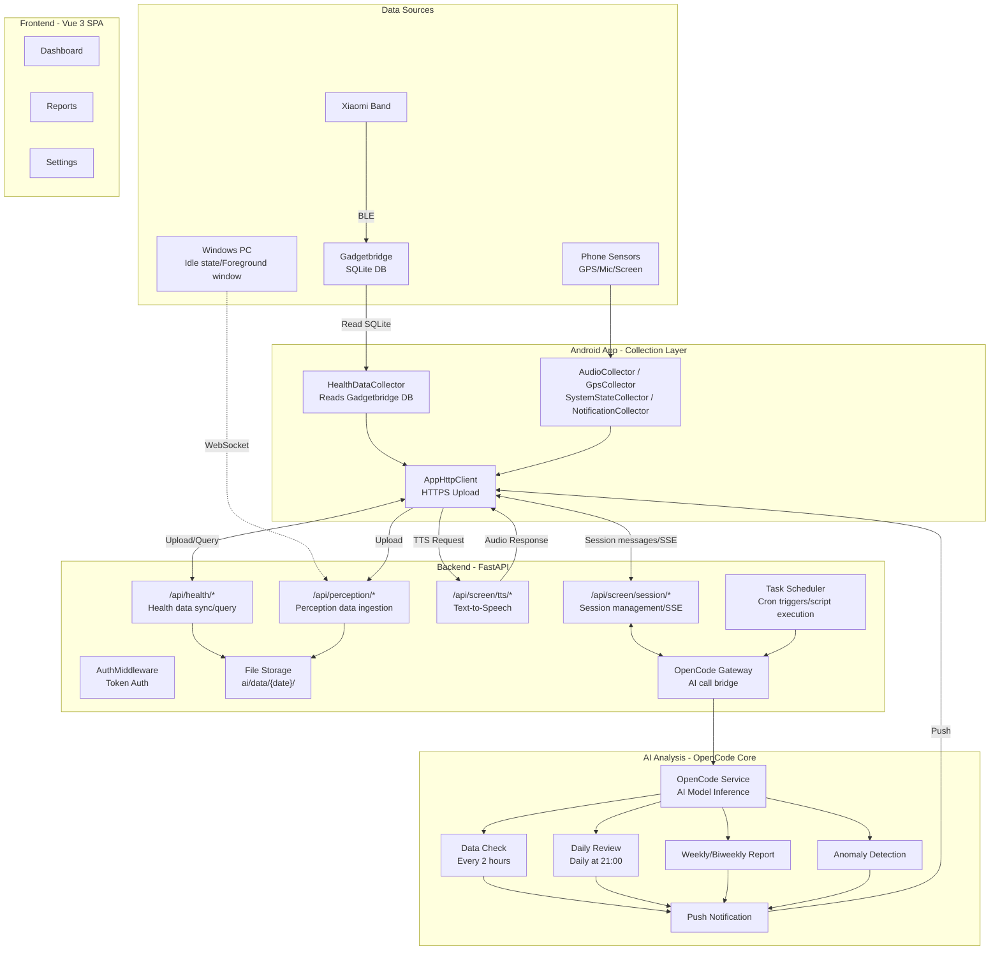
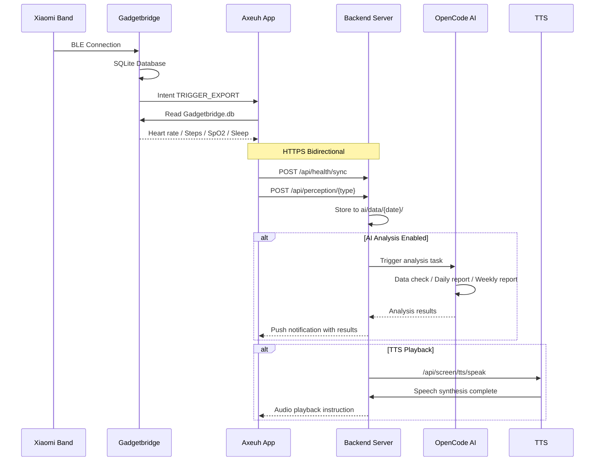

# LiveLog-AI

**English** | [中文](README.zh-CN.md)

A self-hosted AI personal data assistant. An Android app continuously collects sensor data from your phone and smart band (heart rate, steps, GPS, ambient audio, notifications, screen state, and more), uploads it to your private backend, where OpenCode AI periodically analyzes everything and generates insight reports.

This is not just another health tracker. It is a **continuously running AI agent that learns about you**: your daily rhythms, your behavioral patterns, your anomalies. At the end of each day, it tells you how your day went. All running on your own server.

**Use cases**: personal life data archiving, AI daily/weekly reports, behavioral pattern analysis, anomaly detection and alerting.

> **Project status**: Early stage. The author is busy with studies, but the system runs daily and is stable. There may be legacy issues and compatibility gaps. Currently only tested on Windows. Linux and macOS may work but are untested. The frontend (Vue SPA) has several interaction bugs that may affect the user experience.
>
> **On AI capabilities**: Do not expect the AI to truly understand you. Audio processing is limited. Do not rely on the imperfect ASR and speaker recognition to accurately determine your context and activities. The system cannot perceive stretching, yawning, mental state, emotions, or other subtle details of daily life. That said, the system is still useful. With enough accumulated data, the AI can analyze your behavioral habits, movement patterns, communication style, and tendencies.

---

## Architecture



### Data Flow



---

## Prerequisites

| Item      | Requirement                                                    |
| --------- | -------------------------------------------------------------- |
| Server    | Any machine running Python 3.10+ (Windows / Linux / macOS)    |
| Phone     | Android 8.0+ (API 26), 12GB+ storage recommended              |
| Band      | Xiaomi Band 8 Pro / 9 Pro (or other Gadgetbridge-supported model) |
| Core      | OpenCode + Oh My OpenAgent + opencode-dcp plugin              |

## Model Dependencies

The project depends on several AI models, split into a required LLM and optional audio ML models.

### Core LLM (Required, invoked by OpenCode)

| Model              | Purpose                 | Provider     | Configuration                           |
| ------------------ | ----------------------- | ------------ | --------------------------------------- |
| deepseek-v4-flash  | Default AI reasoning    | DeepSeek     | `config.yaml` -> `opencode.default_model` |

OpenCode supports any OpenAI-compatible model provider (DeepSeek, Anthropic, OpenAI, etc). Switch models in `backend/config/model_config.json` or OpenCode configuration.

### Audio ML Models (Optional, enhance audio analysis)

Install with: `pip install torch torchaudio funasr modelscope`

| Model                                                         | Purpose                                         | Source              | First Load                |
| ------------------------------------------------------------- | ------------------------------------------------ | ------------------- | ------------------------- |
| **SenseVoiceSmall** (`iic/SenseVoiceSmall`)           | Multilingual ASR (Chinese/English/Japanese/Cantonese etc.) | ModelScope / funasr | Auto-download, ~1-3 min |
| **emotion2vec_plus_base** (`iic/emotion2vec_plus_base`) | Speech emotion recognition (happy/sad/angry etc.) | ModelScope / funasr | Auto-download            |
| **PANNs Cnn14_16k**                                        | Environmental sound classification (527 AudioSet labels) | Zenodo auto-download | Auto-download, ~200MB  |
| **Silero VAD**                                             | Voice Activity Detection (pre-segment speech)     | silero_vad package  | Included with pip         |
| **funasr ERes2NetV2**                                      | Speaker embedding extraction (speaker recognition) | funasr / modelscope | Auto-download            |

Without these models, the backend still starts fine. Audio analysis, speaker recognition, and scene awareness features will be degraded. TTS can be swapped by implementing `backend/services/tts_player.py`.

### Other

| Feature         | Dependency                    | Notes                                               |
| --------------- | ----------------------------- | --------------------------------------------------- |
| Speaker diarization | librosa + sklearn + numpy | Pure algorithm (MFCC + hierarchical clustering), no external model |
| TTS synthesis   | MiMo Cloud API                | Not a local model, requires `api.mimo_key`          |

---

## Installation

### Phase 1: Backend

#### 1.1 Clone

```bash
git clone https://github.com/Axeuh/LiveLog-AI.git
cd LiveLog-AI
```

#### 1.2 Python environment

```bash
# Create a virtual environment (conda or venv)
python -m venv venv
# Windows: venv\Scripts\activate
# Linux:   source venv/bin/activate

pip install -r backend/requirements.txt
```

For ML features like speaker recognition:

```bash
pip install torch torchaudio --index-url https://download.pytorch.org/whl/cu124
pip install funasr modelscope
# Or with one command:
pip install -e ".[ml]"
```

#### 1.3 Configuration

Edit `config.yaml` in the project root. These fields are required:

```yaml
auth:
  username: admin                    # Login username
  password_hash: ""                  # Required: bcrypt password hash (see below)

ssl:
  enabled: true                      # HTTPS toggle (Android App requires HTTPS)
  cert: /path/to/your/cert.pem       # Replace with actual path
  key:  /path/to/your/key.pem        # Replace with actual path
```

**Generate password_hash**:

```bash
python -c "import bcrypt; print(bcrypt.hashpw(b'your_password', bcrypt.gensalt()).decode())"
```

Copy the output hash into `config.yaml` under `password_hash`.

> If `password_hash` is empty and no `backend/config/auth.json` exists, the server will crash on startup. This is intentional to prevent deploying without a password.

#### 1.4 SSL Certificate (Android App requires this)

The Android App enforces HTTPS. For development, use a self-signed certificate:

```bash
# Generate a self-signed certificate (365-day validity)
openssl req -x509 -newkey rsa:4096 -keyout key.pem -out cert.pem \
  -days 365 -nodes -subj "/CN=<YOUR_SERVER_IP_OR_DOMAIN>"

# Set ssl.cert / ssl.key in config.yaml to the generated files
```

When connecting to a self-signed server for the first time, open `https://<YOUR_IP>:<PORT>/health` in a browser on the Android device and accept the certificate. Alternatively, import `cert.pem` into the Android trust store.

**For production, use a CA-trusted certificate** (e.g., Let's Encrypt).

#### 1.5 Third-party API Key (Optional)

```yaml
api:
  mimo_key: YOUR_MIMO_API_KEY        # Xiaomi MiMo API for TTS synthesis
  # Get one at: https://mimo.xiaomi.com/
```

Without `mimo_key`, core features still work. Only TTS endpoints are unavailable.

#### 1.6 Start the Backend

```bash
# Option 1: Unified launcher (recommended, reads config.yaml automatically)
python launcher.py

# Option 2: Backend only (dev mode, HTTP on 8768)
cd backend && python -m uvicorn main:app --reload --port 8768

# Option 3: Windows one-click
start.bat
```

Verify:

```bash
curl http://127.0.0.1:8768/health
# {"status":"healthy"}
```

#### 1.7 Launcher Path Configuration (if using launcher.py)

```yaml
launcher:
  conda_python: D:\ProgramData\miniconda3\envs\axeuh-multi-agent\python.exe
  opencode_cmd: C:\Users\Administrator\AppData\Roaming\npm\opencode.cmd
```

If paths are unset or incorrect, the launcher falls back to system Python and `shutil.which('opencode')`.

---

### Phase 2: Frontend

The frontend is pre-built. The compiled output lives in `frontend/mobile/dist/` and is served automatically by the backend at the `/mobile/` path.

**No extra steps required.** After starting the backend, visit `https://<SERVER_IP>:<PORT>/mobile/` in a browser (HTTP also works in dev mode).

To build from source:

```bash
cd frontend/mobile
npm install
npm run build    # Outputs to dist/
```

---

### Phase 3: Android App

Download the latest APK from [GitHub Releases](https://github.com/Axeuh/LiveLog-AI/releases), or build it yourself:

```bash
# Build Debug APK
cd app
../gradlew assembleDebug
# Output: app/build/outputs/apk/debug/app-debug.apk
```

Build requirements (if building from source):

- Android Studio Hedgehog (2023.1)+ or Gradle CLI
- JDK 17
- Android SDK 36

---

### Phase 4: Phone Setup

This phase requires hands-on work on your phone.

#### 4.1 Install and Open the App

1. Transfer the APK to your phone and install it
2. Open the app. The settings page will open automatically on first launch

#### 4.2 Configure Server Address

In the Settings page, fill in the **Server Address** field:

```
https://<YOUR_SERVER_IP>:<PORT>
```

- LAN: `https://192.168.x.x:<PORT>` (port matches `https_port` in config.yaml)
- Public network: `https://your-domain.com:<PORT>`
- Local test: `https://localhost:8767` (Android App default)

Tap **Save and Test Connection** and wait for "Connection successful".

#### 4.3 Login

Enter the username and password (matching `config.yaml`). After successful login, the token is saved automatically.

#### 4.4 Grant Permissions

Follow the prompts to grant each permission. Each step has an in-app guide:

| Permission                | Purpose                             | Notes                        |
| ------------------------- | ----------------------------------- | ---------------------------- |
| Notification listener     | Collect notification stats          | Enable manually in system settings |
| Microphone                | Ambient audio recording and analysis | Dialog prompt                |
| GPS location              | Location tracking                   | Dialog prompt (recommend "Allow all the time") |
| Storage                   | Read Gadgetbridge database          | Dialog prompt                |
| Accessibility service     | Foreground app / screen state       | Enable manually in system settings |
| Display pop-ups           | Show notifications                  | Extra step for Xiaomi/OPPO   |
| Battery optimization -> unrestricted | Prevent Service from being killed | Required on Xiaomi/OPPO/Huawei |

> **Xiaomi/Redmi users**: Lock the app in the recent tasks screen (pull down on the card until a lock icon appears) to prevent the system from clearing it.

#### 4.5 Verify

Return to the main screen. The status bar should show "Sensors running". The sensor preview area in Settings should display live data.

---

### Phase 5: Band Health Data (Gadgetbridge)

Health data (heart rate, steps, SpO2, stress, sleep stages) comes from your band through **Gadgetbridge**, an open-source third-party app.

#### 5.1 Install Gadgetbridge

From F-Droid: https://f-droid.org/packages/nodomain.freeyourgadget.gadgetbridge/

Alternative: GitHub Releases: https://github.com/Freeyourgadget/Gadgetbridge/releases

> Do not install from Google Play. The F-Droid or GitHub versions are updated much faster.

#### 5.2 Pair the Band

Open Gadgetbridge and scan for your band.

**About the Auth Key**: Xiaomi Band 8 Pro and 9 Pro require a 32-character hexadecimal Auth Key to connect. Here is how to obtain one:

1. Install the official **Mi Fitness** app (version must be below 3.36; newer versions cannot extract the key). Connect your band normally and use it at least once.
2. Enable **USB debugging** on your phone and connect it to a computer, then run:
   ```
   adb shell
   cd /storage/emulated/0/Android/data/com.mi.health/files/log/
   cat Transfer.device.log | grep token
   ```
3. The log contains two tokens: your **Mi Account token** and the **band Auth Key** (a 32-character hex string). The latter is what Gadgetbridge needs for pairing.
4. Try both tokens if unsure. The Auth Key is the one you enter in the Gadgetbridge pairing screen.
5. If your Mi Fitness version is too new and cannot extract the key, search for alternative methods on Chinese forums like Mitan or Bilibili.

> The Auth Key is only needed for initial pairing. Once paired, you will not need it again unless you unbind the band.

#### 5.3 Enable Auto-Export

```
Gadgetbridge Settings -> Automation
  |- Auto export database -> ON
  |- Export path -> Keep default (/storage/emulated/0/Gadgetbridge.db)
  |- Tap "Run auto export now" (top-right menu) -> Verify it works
```

#### 5.4 Enable Intent API (Recommended)

```
Gadgetbridge Settings -> Developer options -> Intent API
  |- Allow activity sync trigger        -> ON
  |- Broadcast after activity sync      -> ON
  |- Allow database export              -> ON
  |- Broadcast after database export    -> ON
```

With this enabled, the Axeuh App background service can broadcast an intent to trigger Gadgetbridge to export its database on demand, achieving **automatic periodic collection** (roughly every 5 minutes) instead of waiting for Gadgetbridge's built-in one-hour interval.

#### 5.5 Set Database Path in the App

```
Axeuh App Settings -> Data Collection -> Band database path
  -> Select /storage/emulated/0/Gadgetbridge.db
```

If the path is correct, the health data status section below will show heart rate, steps, and other values. Tap "Sync data now" to test manually.

#### 5.6 Disable Mi Fitness Background (Critical)

Both apps will fight for the BLE connection, causing Gadgetbridge to disconnect constantly. **You must prevent Mi Fitness from connecting to the band automatically:**

```
Phone Settings -> App Management -> Mi Fitness
  -> Auto-start -> OFF
  -> Battery optimization -> Restricted
  -> Permissions -> Nearby devices -> DENY (or disable Bluetooth scanning in system settings)

If the band is already unpaired from Mi Fitness:
  -> Bluetooth settings -> Find Xiaomi Band -> Unpair / Forget device
```

After this, only Gadgetbridge will connect to your band. Data collection will be stable.

---

## Sensor Reference

| Sensor        | Collector              | Data                                    | Interval | Togglable? |
| ------------- | ---------------------- | --------------------------------------- | -------- | ---------- |
| Band health   | HealthDataCollector    | Heart rate, steps, SpO2, stress, sleep stages | 5 min | Yes        |
| GPS           | GpsCollector           | Lat/lng, speed, accuracy                | 5 min    | Yes        |
| Ambient audio | AudioCollector         | Audio segments (VAD-gated) + speaker embedding | Continuous | Yes  |
| System state  | SystemStateCollector   | WiFi/BT state, screen on/off, foreground app, battery | 5 sec | Yes |
| Notifications | NotificationCollector  | Notification count, source app           | 5 sec    | Yes        |
| Accessibility | AccessibilityService   | Foreground app, typed content (requires accessibility permission) | 5 sec | Yes |

All sensors can be toggled independently. Nothing is forced on.

---

## Optional Features

### AI Analysis (OpenCode)

OpenCode is the **core component** of this system. All AI features depend on it. The system uses Oh My OpenAgent to manage OpenCode, leveraging its automatic loading of `AGENTS.md` files from subdirectories to organize AI agent context. The `opencode-dcp` plugin gives the AI the ability to autonomously prune its context, preventing context overflow in long conversations.

After installing OpenCode and Oh My OpenAgent, configure in `config.yaml`:

```yaml
opencode:
  port: 5090                    # OpenCode service port
  directory: ai                 # AI working directory
```

The launcher (`launcher.py`) will start OpenCode automatically. If OpenCode cannot start, the TaskScheduler will fail to initialize and the backend will not run properly.

Core AI capabilities:

- **Scheduled data check**: Verifies data integrity every 2 hours
- **Daily review**: Generates a full-day retrospective report at 21:00
- **Trend analysis**: Weekly/biweekly behavioral pattern reports
- **Anomaly detection**: Sudden heart rate changes, abnormal activity, insufficient sleep, etc.
- **Interactive chat**: Talk to the AI through the app's session interface
- **Push notifications**: Analysis results pushed to the app in real time

### Windows PC Agent

A standalone service that runs on Windows and collects PC state:

- System idle / locked state
- Current foreground window title

```bash
cd agent
pip install -r requirements.txt
python agent_server.py
```

Agent configuration is in `agent/config.json`. The `agent_token` is used for API authentication.

> Note: The agent code contains legacy features like screenshots, file operations, and command execution. These are unstable, unmaintained, and not recommended for use.

---

## Configuration Reference

The full configuration file `config.yaml` lives in the project root:

```yaml
server:
  host: 0.0.0.0          # Listen address
  https_port: 1256        # HTTPS port

opencode:
  port: 5090              # OpenCode port

ssl:
  enabled: true           # HTTPS toggle
  cert: /path/to/cert.pem # Certificate path
  key:  /path/to/key.pem  # Private key path

auth:
  username: admin         # Login username
  password_hash: ""       # bcrypt password hash (required)

api:
  mimo_key: ""            # MiMo API Key (optional, for TTS)

features:
  opencode_mock_enabled: false  # Debug only, skips real AI service
```

See `backend/config/config.example.yaml` for all optional fields.

---

## Directory Structure

```
LiveLog-AI/
├── config.yaml                # Configuration file (project root)
├── launcher.py                # Unified launcher
├── start.bat                  # Windows one-click start
├── backend/                   # FastAPI backend
│   ├── main.py                # Entry point
│   ├── routers/               # API routes
│   ├── services/              # Business services
│   ├── middleware/             # Auth middleware
│   ├── config/                # Configuration module
│   └── tests/                 # Tests
├── frontend/mobile/           # App WebView frontend (Vue 3)
│   └── dist/                  # Pre-built artifacts
├── app/                       # Android data collection app (Kotlin)
│   ├── src/                   # Source code
│   └── docs/                  # Band data collection guide, etc.
├── ai/                        # AI analysis system
│   ├── agents/                # Sub-agent definitions
│   ├── analysis/              # Analysis scripts
│   └── data/tasks/            # Task configuration (disabled by default)
├── agent/                     # Windows PC state collector
└── scripts/                   # Utility scripts
```

---

## API Endpoints

| Endpoint                   | Method | Description                              |
| -------------------------- | ------ | ---------------------------------------- |
| `/health`                  | GET    | Health check                             |
| `/login`                   | POST   | Login and get token                      |
| `/auth/check`              | GET    | Token validity check                     |
| `/api/health/sync`         | POST   | Upload health data (heart rate, steps, sleep, etc.) |
| `/api/health/query`        | GET    | Query health data                        |
| `/api/health/upload-db`    | POST   | Upload Gadgetbridge database file        |
| `/api/perception/*`        | POST   | Upload perception data (GPS, system state, notifications) |
| `/api/screen/tasks`        | GET    | List scheduled tasks                     |
| `/api/screen/tts/speak`    | POST   | TTS speech synthesis                     |
| `/api/screen/session/*`    | *      | AI session management                    |
| `/api/screen/ws`           | WS     | Main WebSocket connection                |
| `/api/speakers/*`          | *      | Speaker (voiceprint) management          |
| `/api/notification/*`      | *      | Push notification management             |
| `/api/ota/*`               | *      | OTA auto-update                          |
| `/mobile`                  | GET    | App WebView frontend page                |

---

## FAQ

**Q: Startup error "Please set AUTH_PASSWORD_HASH in config.yaml"**

A: You must set a bcrypt password hash in `config.yaml` on first startup. See the Configuration section above.

**Q: Android App cannot connect to the server**

A: Check:

1. The server firewall is open for the configured port
2. Use `openssl s_client -connect <IP>:<PORT>` to verify the certificate
3. The URL in the app must start with `https://`
4. The phone and server are on the same network (LAN), or the server has a public IP

**Q: Band keeps disconnecting**

A: Two apps are fighting for the BLE connection. See the "Disable Mi Fitness Background" step in the Gadgetbridge section above.

**Q: Health data shows nothing**

A: Check:

1. Gadgetbridge is paired with the band and syncing data normally
2. The band database path in the app settings is correct (default: `/storage/emulated/0/Gadgetbridge.db`)
3. Tap "Sync data now" and wait 10 seconds, then check the data status again
4. Auto-export is enabled in Gadgetbridge

**Q: Frontend page shows 404**

A: The `frontend/mobile/dist/` directory is missing. Either make sure `dist/` was included when cloning, or run `npm run build` yourself.

**Q: Background Service keeps getting killed**

A: Xiaomi, OPPO, Huawei and other OEMs aggressively restrict background processes. You must:

1. Lock the app in recent tasks (pull down on the card)
2. Settings -> Battery optimization -> Unrestricted
3. Enable auto-start
4. On some systems, also add the app to "Protected apps" in the security center

---

## License

[Apache 2.0](LICENSE) (c) 2026 Axeuh

## Contributing

Contributions are welcome. See [CONTRIBUTING.md](CONTRIBUTING.md) for how to get involved.
