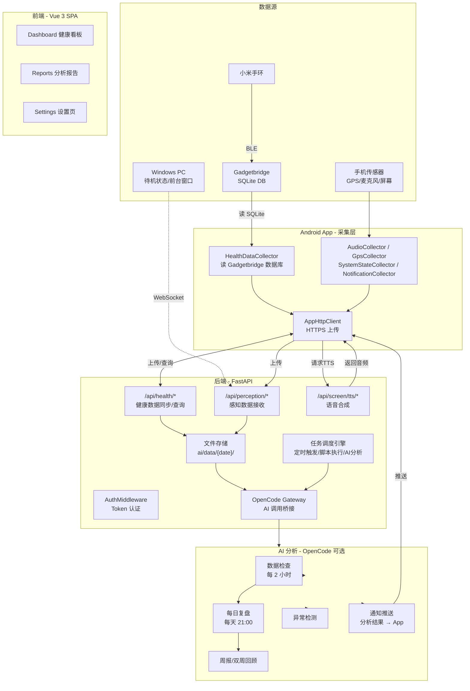
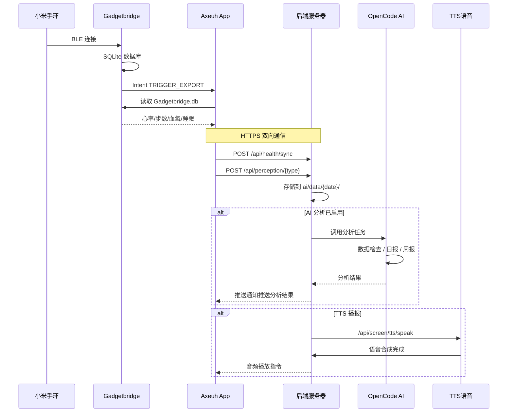

# Axeuh Health Monitor

自托管的 AI 个人数据助理。通过 Android App 持续采集手机和手环传感器数据（心率、步数、GPS、音频环境、通知、屏幕状态等），上传至私有后端存储，由 AI 定时分析并生成洞察报告。

不是单纯的健康追踪工具，而是一个**持续运行、主动理解你的 AI 代理**：它学习你的作息规律、监测异常变化、在每天结束时告诉你今天过得怎么样，全部运行在你自己的服务器上。

**适用场景**：个人生活数据归档、AI 日报/周报、行为模式分析、异常检测预警。

> **现状说明**：本项目处于初期阶段。作者忙于学业，但系统本人一直在使用，运行稳定。可能存在历史遗留问题和兼容性缺陷。目前仅在 Windows 平台测试，Linux 和 macOS 理论上可以运行但未经测试。
>
> **关于 AI 能力**：不要幻想 AI 能有多懂你。本项目的声音处理精度有限，不要指望靠不太靠谱的 ASR 和声纹就能准确判断你的场景和行为。也无法感知到伸懒腰、打哈欠、精神状态、情绪这些细微的生活细节。但这不代表系统不能用——在大量数据积累下，AI 仍然可以分析出你的行为习惯、出行规律、交流风格和做事倾向。

---

## 系统架构



### 数据流



---

## 先决条件

| 项目   | 要求                                                      |
| ------ | --------------------------------------------------------- |
| 服务器 | 任意可运行 Python 3.10+ 的机器（Windows / Linux / macOS） |
| 手机   | Android 8.0+（API 26），建议 12GB+ 存储空间               |
| 手环   | 小米手环 8 Pro / 9 Pro（或其他 Gadgetbridge 支持的型号）  |
| 可选   | Node.js 18+（如需自行构建前端）                           |
| 可选   | OpenCode CLI（如需 AI 分析功能）                          |

---

## 安装步骤

### 第一阶段：后端部署

#### 1.1 克隆仓库

```bash
git clone https://github.com/Axeuh/axeuh-health-monitor.git
cd axeuh-health-monitor
```

#### 1.2 Python 环境

```bash
# 推荐使用 conda 或 venv 创建独立环境
python -m venv venv
# Windows: venv\Scripts\activate
# Linux:   source venv/bin/activate

pip install -r backend/requirements.txt
```

如需声纹识别等 ML 功能，额外安装：

```bash
pip install torch torchaudio --index-url https://download.pytorch.org/whl/cu124
pip install funasr modelscope
# 或一条命令：
pip install -e ".[ml]"
```

#### 1.3 配置

编辑项目根目录的 `config.yaml`，以下字段必须填写：

```yaml
auth:
  username: admin                    # 登录用户名
  password_hash: ""                  # 必须：bcrypt 密码哈希（见下方生成方法）

ssl:
  enabled: true                      # HTTPS 开关（Android App 需要 HTTPS）
  cert: /path/to/your/cert.pem       # 请填入实际路径
  key:  /path/to/your/key.pem        # 请填入实际路径
```

**生成 password_hash**：

```bash
python -c "import bcrypt; print(bcrypt.hashpw(b'你的密码', bcrypt.gensalt()).decode())"
```

把输出的哈希值填入 `config.yaml` 的 `password_hash` 字段。

> 如果 `password_hash` 为空且 `backend/config/auth.json` 不存在，服务启动时会直接崩溃。这是为了防止无密码暴露。

#### 1.4 SSL 证书（Android App 必须）

Android App 强制使用 HTTPS。开发环境可用自签名证书：

```bash
# 生成自签名证书（有效期 365 天）
openssl req -x509 -newkey rsa:4096 -keyout key.pem -out cert.pem \
  -days 365 -nodes -subj "/CN=<你的服务器IP或域名>"

# 将 cert.pem / key.pem 路径填入 config.yaml 的 ssl.cert / ssl.key
```

Android App 首次连接自签名服务器时，需在浏览器中打开 `https://<你的IP>:<端口>/health` 并信任证书。也可将 `cert.pem` 导入 Android 信任存储。

**生产环境请使用受信任 CA 签发的证书**（如 Let's Encrypt）。

#### 1.5 第三方 API Key（可选）

```yaml
api:
  mimo_key: YOUR_MIMO_API_KEY        # 小米 MiMo API，用于 TTS 语音合成
  # 获取: https://mimo.xiaomi.com/
```

缺省 `mimo_key` 不影响核心功能，仅 TTS 端点不可用。

#### 1.6 启动后端

```bash
# 方式一：统一启动器（推荐，自动读取 config.yaml）
python launcher.py

# 方式二：仅启动后端（开发模式，HTTP 8768）
cd backend && python -m uvicorn main:app --reload --port 8768

# 方式三：Windows 一键启动
start.bat
```

验证后端运行：

```bash
curl http://127.0.0.1:8768/health
# {"status":"healthy"}
```

#### 1.7 Launcher 路径配置（如使用 launcher.py）

```yaml
launcher:
  conda_python: D:\ProgramData\miniconda3\envs\axeuh-multi-agent\python.exe
  opencode_cmd: C:\Users\Administrator\AppData\Roaming\npm\opencode.cmd
```

如果未配置或路径错误，launcher 会自动回退到系统 Python 和 `shutil.which('opencode')`。

---

### 第二阶段：前端

前端已预构建，`frontend/mobile/dist/` 目录已包含编译产物，后端会自动在 `/mobile/` 路径下提供。

**无需额外操作。** 后端运行后访问 `http://<服务器IP>:<端口>/mobile/` 即可看到健康看板页面。

如需自行构建：

```bash
cd frontend/mobile
npm install
npm run build    # 输出到 dist/
```

---

### 第三阶段：Android App 安装

从 [GitHub Releases](https://github.com/Axeuh/axeuh-health-monitor/releases) 下载最新 APK，或自行编译：

```bash
# 编译 Debug APK
cd app
../gradlew assembleDebug
# 产物: app/build/outputs/apk/debug/app-debug.apk
```

编译要求（自行编译时）：

- Android Studio Hedgehog (2023.1)+ 或命令行 Gradle
- JDK 17
- Android SDK 36

---

### 第四阶段：手机端配置

此阶段需要在手机上逐步操作。

#### 4.1 安装并打开 App

1. 将 APK 传输到手机安装
2. 打开 App → 进入设置页面（首次启动自动跳转）

#### 4.2 配置服务器地址

在设置页的 **服务器地址** 字段填入：

```
https://<你的服务器IP>:<端口>
```

- 局域网：`https://192.168.x.x:1256`
- 公网：`https://你的域名:1256`
- 本地测试：`https://localhost:8767`

点击"保存并测试连接"，等待显示"连接成功"。

#### 4.3 登录

输入用户名和密码（即 `config.yaml` 中配置的账号密码），点击登录。登录成功后 token 会自动保存。

#### 4.4 授予权限

根据提示依次授予权限，每项都有弹窗指引：

| 权限               | 用途                     | Android 版本注意             |
| ------------------ | ------------------------ | ---------------------------- |
| 通知监听权限       | 采集通知统计             | 手动在系统设置中开启         |
| 麦克风权限         | 环境音录音分析           | 弹窗授予                     |
| GPS 定位权限       | 位置轨迹                 | 弹窗授予（建议选"始终允许"） |
| 存储权限           | 读取 Gadgetbridge 数据库 | 弹窗授予                     |
| 无障碍服务         | 前台应用/屏幕状态感知    | 手动在系统设置中开启         |
| 后台弹出界面       | 通知显示                 | 小米/OPPO 等需要额外允许     |
| 省电策略 → 无限制 | 防止 Service 被杀死      | 小米/OPPO 等必须设置         |

> **小米/红米手机注意**：在"最近任务"界面将 App 锁定（下拉卡片出现锁图标），防止系统清理后台。

#### 4.5 确认 App 运行

返回 App 主界面，查看状态栏是否显示"传感器运行中"。设置页的传感器预览区应能看到实时更新的传感器数据。

---

### 第五阶段：手环健康数据配置（Gadgetbridge）

健康数据（心率、步数、血氧、压力、睡眠）通过 **Gadgetbridge**（开源第三方 App）从手环获取。

#### 5.1 安装 Gadgetbridge

从 F-Droid 下载安装：https://f-droid.org/packages/nodomain.freeyourgadget.gadgetbridge/

> 不要从 Google Play 安装，F-Droid 版本更新更快。

#### 5.2 配对手环

首次打开 Gadgetbridge 后扫描并配对手环。

**关于 Auth Key**：小米手环 8 Pro / 9 Pro 需要 32 位十六进制 Auth Key 才能连接。获取方法：

1. 安装 **小米运动健康（Mi Fitness）**App，正常连接手环并使用至少一次
2. 开启手机的 **USB 调试**，连接电脑执行：
   ```
   adb shell
   cd /storage/emulated/0/Android/data/com.xiaomi.hm.health/files/log/
   cat Transfer.device.log | grep token
   ```
3. 日志中能找到两个 token：**小米账号 token** 和 **手环 Auth Key**（32 位十六进制字符串）-- 后者才是 Gadgetbridge 配对需要的
4. 两种 token 都试试，Auth Key 通常在 Gadgetbridge 配对界面输入

> 首次配对手环时需要 Auth Key，配对成功后除非解除绑定，否则不再需要。

#### 5.3 配置自动导出数据库

```
Gadgetbridge 设置 → 自动化
  ├─ 自动导出数据库 → 开启
  └─ 导出路径 → 保持默认（/storage/emulated/0/Gadgetbridge.db）
```

#### 5.4 开启 Intent API（可选但推荐）

```
Gadgetbridge 设置 → 开发者选项
  ├─ 意图接口 → 开启 ACTIVE_SYNC
  └─ 意图接口 → 开启 TRIGGER_EXPORT
```

开启后，Axeuh App 的后台 Service 可发送广播主动触发 Gadgetbridge 导出数据库，实现**自动定时采集**（约 5 分钟一次），无需等待 Gadgetbridge 自身的一小时间隔。

#### 5.5 在 App 中设置数据库路径

```
Axeuh App 设置 → 数据采集 → 手环数据库路径
  → 选择 /storage/emulated/0/Gadgetbridge.db
```

如果路径正确，下方健康数据状态区域将显示心率/步数等数据。点击"立即同步数据"可手动测试。

#### 5.6 禁用小米运动健康后台（关键！）

两个 App 会互相抢 BLE 连接，导致 Gadgetbridge 频繁断连。**必须禁止小米运动健康自动连接手环：**

```
手机设置 → 应用管理 → 小米运动健康
  → 自启动 → 关闭
  → 省电策略 → 限制后台
  → 权限 → 附近设备 → 拒绝（或在系统设置中禁止蓝牙扫描）

如果手环取消了与小米运动健康的配对：
  → 蓝牙设置 → 找到小米手环 → 取消配对/忽略设备
```

做完后，只有 Gadgetbridge 会连接手环，数据采集稳定。

---

## 传感器说明

| 传感器   | 采集器                | 数据项                             | 间隔   | 可关闭？ |
| -------- | --------------------- | ---------------------------------- | ------ | -------- |
| 手环健康 | HealthDataCollector   | 心率、步数、血氧、压力、睡眠阶段   | 5 分钟 | 是       |
| GPS      | GpsCollector          | 经纬度、速度、精度                 | 5 分钟 | 是       |
| 环境音频 | AudioCollector        | 录音片段（VAD 检测）+ 声纹         | 连续   | 是       |
| 系统状态 | SystemStateCollector  | WiFi/BT/屏幕/前台 App/电量         | 5 秒   | 是       |
| 通知     | NotificationCollector | 通知计数、来源应用                 | 5 秒   | 是       |
| 辅助功能 | AccessibilityService  | 前台应用、输入内容（需无障碍权限） | 5 秒   | 是       |

所有传感器均可独立开关，不强制全开。

---

## 可选功能

### AI 分析（需 OpenCode）

[OpenCode](https://opencode.ai) 是一个 AI agent 运行时环境。安装后配置：

```yaml
opencode:
  port: 5090                    # OpenCode 服务端口
  directory: ai                 # AI 工作目录
```

启动时会自动检测 OpenCode，如果不可用则跳过（后端仍正常运行，仅 AI 功能不可用）。

开启后，AI 系统会：

- 每 2 小时检查数据完整性
- 每日生成健康复盘报告
- 每周/双周输出趋势分析
- 检测心率异常、睡眠不足、活动量过低等
- 通过 App 推送通知提醒

### Windows PC Agent

独立服务，运行在 Windows 电脑上，采集 PC 状态：

- 系统是否待机/锁屏
- 当前前台窗口标题

```bash
cd agent
pip install -r requirements.txt
python agent_server.py
```

Agent 配置在 `agent/config.json` 中，`agent_token` 用于 API 认证。

> 注：Agent 代码中包含截图、文件操作、命令执行等历史遗留功能，这些功能不稳定且不再维护，不建议使用。

---

## 配置参考

完整配置文件 `config.yaml` 位于项目根目录：

```yaml
server:
  host: 0.0.0.0          # 监听地址
  https_port: 1256        # HTTPS 端口

opencode:
  port: 5090              # OpenCode 端口

ssl:
  enabled: true           # HTTPS 开关
  cert: /path/to/cert.pem # 证书路径
  key:  /path/to/key.pem  # 私钥路径

auth:
  username: admin         # 登录用户名
  password_hash: ""       # bcrypt 密码哈希（必填）

api:
  mimo_key: ""            # MiMo API Key（可选，TTS 用）

features:
  opencode_mock_enabled: false  # 调试用，不连真实 AI 服务
```

详见 `backend/config/config.example.yaml` 的所有可选字段。

---

## 目录结构

```
axeuh-health-monitor/
├── config.yaml                # 配置文件（项目根目录）
├── launcher.py                # 统一启动器
├── start.bat                  # Windows 一键启动
├── backend/                   # FastAPI 后端
│   ├── main.py                # 主入口
│   ├── routers/               # API 路由
│   ├── services/              # 业务服务
│   ├── middleware/            # 认证中间件
│   ├── config/                # 配置模块
│   └── tests/                 # 测试
├── frontend/mobile/           # App WebView 前端（Vue 3）
│   └── dist/                  # 预构建产物
├── app/                       # Android 数据采集 App（Kotlin）
│   ├── src/                   # 源代码
│   └── docs/                  # 手环数据采集指南等
├── ai/                        # AI 分析系统
│   ├── agents/                # 子智能体定义
│   ├── analysis/              # 分析脚本
│   └── data/tasks/            # 定时任务配置（默认禁用）
├── agent/                     # Windows PC 状态采集
└── scripts/                   # 工具脚本
```

---

## API 端点

| 端点                      | 方法 | 功能                                |
| ------------------------- | ---- | ----------------------------------- |
| `/health`               | GET  | 健康检查                            |
| `/login`                | POST | 登录获取 Token                      |
| `/auth/check`           | GET  | Token 有效性检查                    |
| `/api/health/sync`      | POST | 健康数据上传（心率/步数/睡眠等）    |
| `/api/health/query`     | GET  | 健康数据查询                        |
| `/api/health/upload-db` | POST | 上传 Gadgetbridge 数据库文件        |
| `/api/perception/*`     | POST | 感知数据上传（GPS/系统状态/通知等） |
| `/api/screen/tasks`     | GET  | 定时任务列表                        |
| `/api/screen/tts/speak` | POST | TTS 语音合成                        |
| `/api/screen/session/*` | *    | AI 会话管理                         |
| `/api/screen/ws`        | WS   | WebSocket 主连接                    |
| `/api/speakers/*`       | *    | 声纹管理                            |
| `/api/notification/*`   | *    | 通知推送                            |
| `/api/ota/*`            | *    | OTA 自动更新                        |
| `/mobile`               | GET  | App WebView 前端页面                |

---

## 常见问题

**Q: 启动报错 "请在 config.yaml 中设置 AUTH_PASSWORD_HASH"**

A: 首次启动必须在 `config.yaml` 中设置 bcrypt 格式的密码哈希。见 [1.3 配置](#13-配置)。

**Q: Android App 连不上服务器**

A: 检查：

1. 服务器防火墙是否放行了对应端口
2. 使用 `openssl s_client -connect <IP>:<端口>` 测试证书是否有效
3. App 中填写的 URL 必须以 `https://` 开头
4. 手机和服务器是否在同一网络（局域网）或服务器有公网 IP

**Q: 手环频繁断连**

A: 两个 App 抢 BLE 连接。见 [5.6 禁用小米运动健康后台](#56-禁用小米运动健康后台关键)。

**Q: 健康数据为空**

A: 检查：

1. Gadgetbridge 是否已配对手环并正常同步数据
2. App 设置中的手环数据库路径是否正确（默认 `/storage/emulated/0/Gadgetbridge.db`）
3. 点击"立即同步数据"后等待 10 秒，再看数据状态
4. Gadgetbridge 的自动导出数据库是否已开启

**Q: 前端页面显示 404**

A: `frontend/mobile/dist/` 目录不存在。要么拉取仓库时包含了 dist/，要么自行运行 `npm run build`。

**Q: 后台 Service 被系统杀死**

A: 小米/OPPO/华为等系统会限制后台进程。必须：

1. 将 App 在最近任务中锁定（下拉卡片）
2. 设置 → 省电策略 → 无限制
3. 允许自启动
4. 部分系统还需在安全中心中设为"受保护应用"

---

## 许可证

[Apache 2.0](LICENSE) © 2026 Axeuh

## 贡献

欢迎贡献！请参阅 [CONTRIBUTING.md](CONTRIBUTING.md) 了解参与方式。
