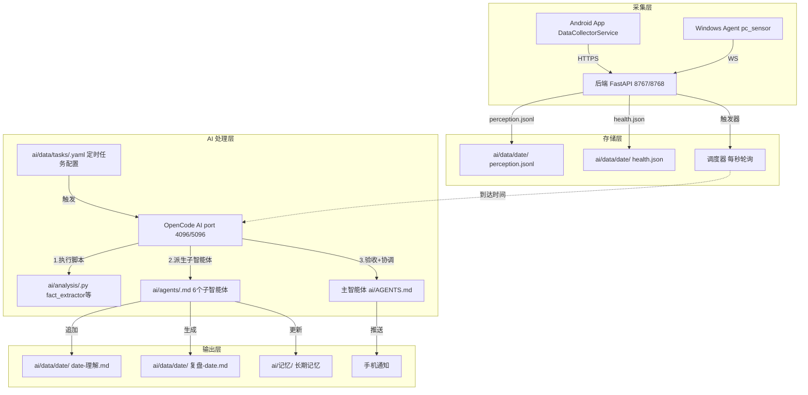
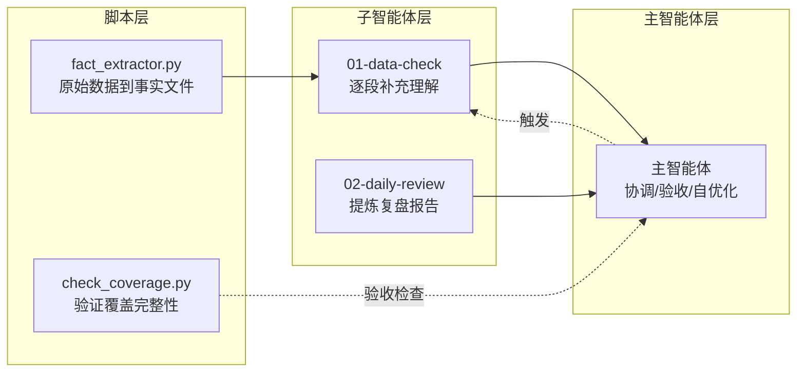
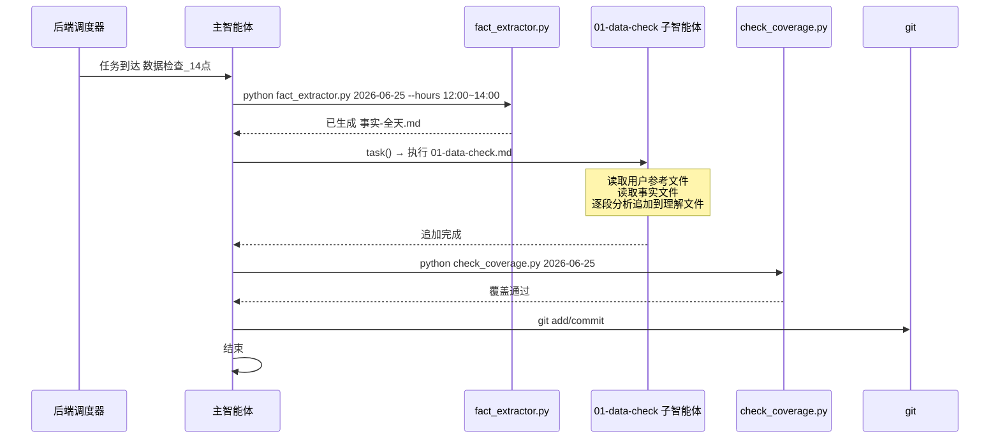
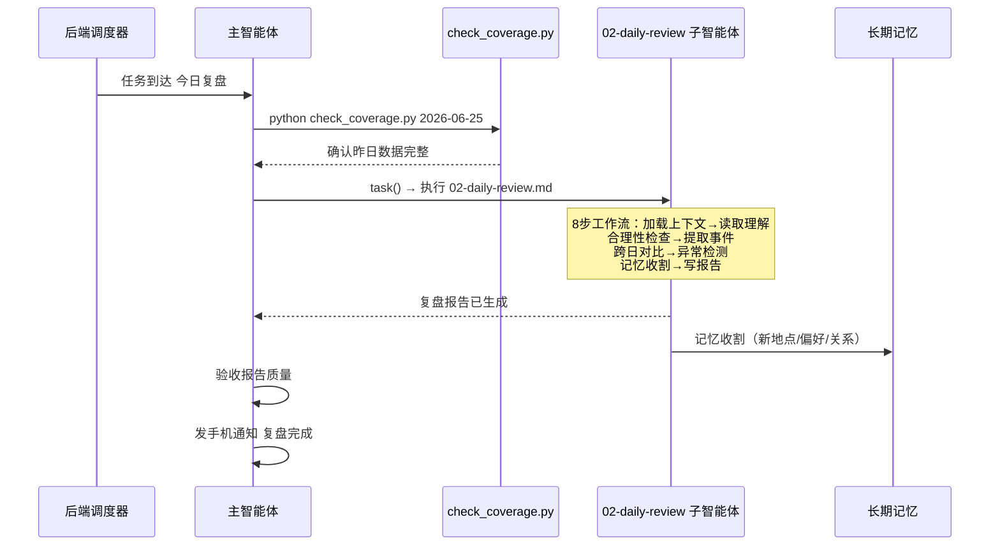

# LiveLog-AI OpenCode AI 系统

> 基于 OpenCode 平台的 AI 感知数据分析系统完整说明

---

- [1. 架构概览](#1-架构概览)
- [2. 三层工作流](#2-三层工作流)
- [3. AI 目录结构](#3-ai-目录结构)
- [4. 定时任务系统](#4-定时任务系统)
- [5. 子智能体 (Agents)](#5-子智能体-agents)
- [6. 分析脚本](#6-分析脚本)
- [7. 数据流详解](#7-数据流详解)
- [8. 记忆系统](#8-记忆系统)
- [9. 核心设计原则](#9-核心设计原则)

---

## 1. 架构概览



OpenCode AI 是整个系统的"大脑"，运行在独立的 OpenCode 服务上（默认端口 4096/5096）。它不直接采集数据——后端 FastAPI 负责所有数据接收、存储和定时任务调度，AI 只读取已存储的数据进行分析。

### 关键设计决策

| 决策 | 说明 |
|------|------|
| AI 不自建服务 | AI 运行在 OpenCode 平台之上，由后端通过 HTTP API 触发任务 |
| 后端不负责 AI | 后端只做数据接收、存储、任务调度，不做任何 AI 分析 |
| 数据文件即接口 | 后端写文件，AI 读文件，两者通过文件系统解耦 |
| 热加载任务 | 修改 `ai/data/tasks/*.yaml` 无需重启，后端自动检测并重载 |

---

## 2. 三层工作流

AI 处理任何数据都遵循 **脚本层 → 子智能体层 → 主智能体层** 三层架构：



### 各层职责

**脚本层** — 数据预处理：
- 读取原始 JSON 数据，转换为 AI 易读的 Markdown 格式
- 去冗余、去噪、提炼关键指标（GPS 去重、HR 范围化）
- 验证数据完整性（是否有超过 2 小时的缺口）

**子智能体层** — 专业分析：
- 6 个子智能体各司其职（见第 5 节）
- 每个子智能体有独立的 prompt，精确规定了输入、输出格式和约束
- 子智能体只做自己的事，不做跨域决策

**主智能体层** — 协调验收：
- 由 OpenCode 的主会话（`ai/AGENTS.md`）执行
- 触发脚本 → 派生子智能体 → 验收结果 → 处理异常
- 检查子智能体输出是否写入成功，失败则重试

---

## 3. AI 目录结构

```
ai/
├── AGENTS.md                    # 主智能体上下文（每次会话自动加载）
├── opencode.json                # OpenCode 配置（禁用某些工具）
├── agents/                      # 子智能体 prompt（6个）
│   ├── 01-data-check.md         #   数据检查
│   ├── 02-daily-review.md       #   每日复盘
│   ├── 03-biweekly-review.md    #   双周深度回顾
│   ├── 04-weekly-review.md      #   每周总结
│   ├── 05-feedback-agent.md     #   反馈推送
│   └── 06-study-coach.md        #   学习助手
├── analysis/                    # Python 分析脚本
│   ├── fact_extractor.py        #   原始数据 → 事实文件（核心）
│   ├── check_coverage.py        #   覆盖完整性验证
│   ├── geocode_tool.py          #   GPS 逆地理编码
│   └── ...                      #   其他分析/调试工具
├── data/                        # 运行时数据（按日期组织）
│   ├── {YYYY-MM-DD}/            #   每日数据目录
│   │   ├── perception.jsonl     #     原始感知数据（只读）
│   │   ├── health.json          #     健康数据（只读）
│   │   ├── 事实-全天.md          #     脚本生成的数据摘要
│   │   ├── {date}-理解.md       #     理解记录（子智能体追加）
│   │   ├── 复盘-{date}.md       #     复盘报告
│   │   ├── 日志-{date}.md       #     对话日志
│   │   └── 反馈-{date}.md       #     反馈详情
│   ├── tasks/                   #   定时任务配置
│   │   ├── *.yaml               #     YAML 任务定义（17个）
│   │   ├── *.py                 #     Python 自定义脚本
│   │   ├── AGENTS.md            #     任务格式说明
│   │   ├── check.py             #     脚本安全审查工具
│   │   └── logs/                #     脚本运行日志
│   ├── tasks.yaml               #   旧版任务文件（降级用）
│   ├── tasks_state.json         #   运行时状态
│   └── task_executions.yaml     #   执行记录
├── 记忆/                        # 长期记忆系统
│   ├── 用户参考.md               #   用户画像
│   ├── 项目参考.md               #   项目状态
│   ├── 经验记录.md               #   经验索引
│   └── 经验/                    #   经验详情
└── screenshots/                 # 截图文件夹
```

### 关键文件说明

| 文件 | 角色 | 谁写 | 谁读 |
|------|------|------|------|
| `perception.jsonl` | 原始感知数据 | 后端（追加写） | AI（只读） |
| `health.json` | 健康数据 | 后端（覆盖写） | AI（只读） |
| `事实-全天.md` | 数据摘要 | 脚本 `fact_extractor.py`（覆盖） | 子智能体（只读） |
| `{date}-理解.md` | 理解记录 | 子智能体 `01-data-check`（追加） | 复盘/周报子智能体 |
| `复盘-{date}.md` | 复盘报告 | 子智能体 `02-daily-review`（覆盖） | 用户/周报子智能体 |
| `tasks/*.yaml` | 定时任务 | 用户/AI（任意写） | 后端调度器 |
| `AGENTS.md` | 主智能体上下文 | 用户/AI（任意写） | OpenCode 会话加载 |

---

## 4. 定时任务系统

任务定义放在 `ai/data/tasks/*.yaml`（新格式），后端调度器每秒轮询，到达 `next_run` 时间时触发 AI 执行。

### 任务格式

```yaml
# ai/data/tasks/example.yaml
name: 示例任务
schedule:
  daily: "08:00"           # 每天 08:00 触发
enabled: true               # 可选，默认 true
prompt: |-                  # 发送给 AI 的指令
  按以下流程执行：
  1. 运行分析脚本
  2. 启动子智能体
  3. 提交 git
```

### schedule 格式

| 表达式 | 说明 |
|--------|------|
| `daily: "08:00"` | 每天 08:00 |
| `hourly: 30` | 每小时的 30 分 |
| `weekly: {days: "mon,wed,fri", at: "09:00"}` | 每周一三五 09:00 |
| `monthly: "1,15 14:30"` | 每月 1 日和 15 日 14:30 |
| `delay: "5m"` | 5 分钟后执行一次 |
| `"daily 04:00"` | 字符串简写 |

### 当前任务清单

**数据检查**（每 2 小时一次，12 个任务）：

| 文件名 | 触发时间 | 检查时段 |
|--------|----------|----------|
| `01-data-check-00.yaml` | 00:00 | 前一天 22:00~00:00 |
| `02-data-check-04.yaml` | 04:00 | 02:00~04:00 |
| `03-data-check-06.yaml` | 06:00 | 04:00~06:00 |
| `04-data-check-08.yaml` | 08:00 | 06:00~08:00 |
| `05-data-check-10.yaml` | 10:00 | 08:00~10:00 |
| `06-data-check-12.yaml` | 12:00 | 10:00~12:00 |
| `07-data-check-14.yaml` | 14:00 | 12:00~14:00 |
| `08-data-check-16.yaml` | 16:00 | 14:00~16:00 |
| `09-data-check-18.yaml` | 18:00 | 16:00~18:00 |
| `10-data-check-20.yaml` | 20:00 | 18:00~20:00 |
| `11-data-check-22.yaml` | 22:00 | 20:00~22:00 |
| `12-data-check-00.yaml` | 00:00 | 22:00~00:00 |

每个数据检查任务的流程完全相同：`fact_extractor.py 日期 --hours 时段 → 启动 01-data-check 子智能体 → check_coverage.py 验证 → git commit`。

**周期性任务**（5 个）：

| 文件名 | 触发 | 职责 |
|--------|------|------|
| `12-daily-review.yaml` | 每天 02:00 | 完整复盘 |
| `13-biweekly-review.yaml` | 每月 1/16 日 03:00 | 双周深度回顾 |
| `14-weekly-summary.yaml` | 每周日 03:00 | 周报总结 |
| `15-study-coach-morning.yaml` | 工作日 08:30 | 早晨学习提醒 |
| `16-study-coach-afternoon.yaml` | 工作日 18:30 | 下午学习检查 |
| `17-study-coach-evening.yaml` | 每天 21:00 | 晚间学习总结 |

### Python 自定义脚本

除了 YAML 定时任务，`ai/data/tasks/` 也支持 `.py` 文件。Python 脚本不受 YAML 的固定调度限制——它们自循环运行，自己控制频率和逻辑，能做的事情远超简单定时触发。

#### 基本格式

```python
"""
name: 脚本名称              # 必填，用于日志和识别
enabled: true                # true=自动启动, false=停止
note: 备注说明               # 可选
prompt: |                    # 调用 trigger_task 时的默认提示词
  请分析今天的感知数据。
"""

def run(context):
    """自循环模式：自己控制执行频率和条件"""
    while True:
        context.log("检查中...")
        # 你的逻辑在这里
        context.heartbeat()   # 必须每30秒至少调用一次
        time.sleep(60)        # 控制轮询间隔
```

#### Context API

| 方法 | 说明 |
|------|------|
| `context.log(msg)` | 记录结构化日志（写入 `logs/{脚本名}/{日期}.log`） |
| `context.trigger_task(target, prompt)` | 触发 AI 任务（prompt 可选，不传则用脚本默认 prompt） |
| `context.alert(msg)` | 报告错误/异常（写入审计日志 `logs/audit/{日期}.jsonl`） |
| `context.read_file(path)` | 读取文件（沙箱路径，相对 `ai/` 目录） |
| `context.heartbeat()` | 保活信号（自循环脚本必须每 30 秒至少调用一次） |

#### 脚本能做到的事

**1. 自定义调度策略**
不限于 YAML 的每日/每周/每月格式，可以实现任意调度逻辑：

```python
def run(context):
    while True:
        now = datetime.now()
        # 只在用户可能在的时段工作
        if 8 <= now.hour < 23:
            # 每 15 分钟检查一次，而非固定间隔
            if now.minute % 15 == 0:
                context.trigger_task("检查")
        # 夜间降低频率
        else:
            time.sleep(300)  # 夜间每 5 分钟
        context.heartbeat()
        time.sleep(60)
```

**2. 条件触发的自动化**
根据数据状态决定是否触发 AI，避免无效执行：

```python
def run(context):
    while True:
        data = context.read_file("data/2026-06-25/perception.jsonl")
        if data:
            lines = data.strip().split("\n")
            last_line = json.loads(lines[-1])
            # 只在有新的 voice 事件时才触发分析
            if last_line.get("type") == "voice" and last_line.get("hasSpeech"):
                context.trigger_task("语音分析", f"最新语音: {last_line.get('asr_text', '')}")
        context.heartbeat()
        time.sleep(120)
```

**3. 集成外部 HTTP API**
可以向任意外部服务发送请求或读取数据：

```python
def run(context):
    while True:
        # 调用外部 API
        resp = http_request("GET", "https://api.weather.com/current")
        if resp and resp.get("temperature"):
            context.log(f"当前温度: {resp['temperature']}°C")
        context.heartbeat()
        time.sleep(1800)
```

> 注意：沙箱默认限制了 `os`、`subprocess`、`socket` 等模块。HTTP 请求可能需要申请解锁或使用后端提供的代理接口。

**4. 智能家居集成（扩展方向）**

脚本架构天然支持扩展为智能家居自动化中枢：

| 场景 | 实现方式 |
|------|----------|
| 读取传感器 | 从 `perception.jsonl` 获取室温/湿度/光照数据（如果 App 上报） |
| 联动场景 | HR 异常时触发 AI 推送告警；GPS 到家时触发离家/回家场景 |
| 语音播报 | 通过后端的 TTS API 播报自定义消息 |
| 状态检查 | 检测到长时间无数据时自动提醒 |
| 定时场景 | 根据用户作息触发特定场景（如睡前关灯） |

```python
# 示意：智能家居联动脚本
def run(context):
    while True:
        # 读取最新感知数据
        data = context.read_file("data/2026-06-25/perception.jsonl")
        if data:
            events = [json.loads(l) for l in data.strip().split("\n") if l]
            last = events[-1] if events else {}
            
            # 1. 到家场景：GPS 到家 + 时间在晚上
            if last.get("type") == "sensor" and "gps" in last:
                lat, lng = last["gps"].split(",")
                if is_within_home(float(lat), float(lng)) and is_evening():
                    context.trigger_task("回家", "用户已到家，执行回家场景")
            
            # 2. 睡眠检测：屏幕锁屏 + 长时间无交互 + HR 下降
            if is_sleep_pattern(events):
                context.trigger_task("睡眠", "用户似乎已入睡")
            
            # 3. 异常告警
            if last.get("phone_battery", 100) < 20:
                context.alert("手机电量不足 20%")
        
        context.heartbeat()
        time.sleep(120)
```

**5. 跨脚本通信**
多个脚本可以通过 `ai/data/` 下的文件间接通信（写入标记文件、共享队列等）。

**6. 后端 API 联动**
脚本可以调用后端内部 API（通过 `localhost`），例如 TTS 播报、发送通知等。

#### 与 YAML 任务的对比

| 维度 | YAML 任务 | Python 脚本 |
|------|-----------|-------------|
| 调度方式 | 系统定时触发（每日/每周等） | 自己控制循环和频率 |
| 逻辑复杂度 | 静态 prompt → AI 执行 | 完整编程能力，动态条件判断 |
| 数据读取 | 由 prompt 中的 AI 逻辑读取 | 直接用 `context.read_file()` 读取 |
| 外部集成 | 依赖 prompt 中的 AI 能力 | 可直接调用 HTTP API |
| 启动时机 | 到达预定时间触发一次 | 启动后常驻运行，自己决定何时做何事 |
| 适用场景 | 固定时间的分析任务 | 实时监控、条件触发、外部集成 |

#### 沙箱限制

| 限制 | 说明 |
|------|------|
| 允许导入 | `math`, `json`, `re`, `datetime`, `time`, `random`, `typing`, `collections`, `pathlib` |
| 部分允许 | `os.path`（仅 `exists/getsize/getmtime/basename/dirname/join/splitext/isfile/isdir/normpath`） |
| 禁止 | `os`(完整模块)、`subprocess`、`socket`、`shutil`、`ctypes`、`requests`、`asyncio`、`threading`、`multiprocessing` |
| 禁止内置 | `eval()`, `exec()`, `compile()`, `__import__()`, `open()`, `input()` |
| 内存限制 | 256 MB |
| trigger_task 速率 | 上限 10 次/分钟 |
| 心跳要求 | 必须每 30 秒至少调用一次 `context.heartbeat()`，超时 60 秒自动终止 |

> 沙箱通过 AST 静态分析检查脚本的导入和函数调用，在启动前就拒绝违规脚本。如需使用沙箱白名单之外的模块，需要向用户请求并更新 `check.py` 中的白名单。

#### 运行时管理

- **自动启动**: 脚本被 `enabled: true` 启用后，FileWatcher 自动检测并启动进程
- **安全审查**: 启动前自动运行 AST 安全检查（`check.py`），有风险直接拒绝
- **日志**: 运行日志写入 `ai/data/tasks/logs/{脚本名}/{日期}.log`
- **审计**: 每次 `trigger_task()` 和 `alert()` 写入 `audit/{日期}.jsonl`
- **热加载**: 修改脚本后自动检测变更，重启脚本进程
- **故障恢复**: 脚本异常退出后自动重试（最多 3 次）

---

## 5. 子智能体 (Agents)

子智能体是独立的 AI prompt 文件，每个有精确的输入输出规范和约束。主智能体通过 `task(subagent_type="general", prompt="请阅读 ai/agents/XX.md 执行...")` 委托它们工作。

### 01-data-check — 数据检查

**用途**: 读取 `事实-全天.md`，对指定时段逐段补充理解到 `{date}-理解.md`。

**核心规则**：
- 每个结论必须有数据支撑，多源交叉验证
- 每个综合判断标注置信度（确定/高/中/低/数据不足）
- GPS 不变段不代表位置没变，只看突变点
- ASR 日语/韩语文本默认视为误识别
- 身份不确定时用泛称，不猜测具体关系
- 禁止修改事实文件，禁止删除已有理解记录

**输出格式**（每段）：

```markdown
## HH:MM~HH:MM

【原始数据摘要】
- 位置: GPS坐标 + 地点名称
- 生理: HR范围及趋势
- 语音: 关键对话（标注sim值和说话人归属）
- 活动线索: App/PC窗口/环境音
- 前后文: 本时段前/后发生了什么

【关键观察】（可选）
【综合判断】一句话描述。置信度: 确定/高/中/低/数据不足
【异常标记】有则写，无则"无异常"
【关联链接】
```

### 02-daily-review — 每日复盘

**用途**: 基于理解记录，提炼每日复盘报告。

**8 步工作流**：
1. 加载用户上下文（读用户参考文件）
2. 读取当日理解文件全文
3. 检查学习进度
4. 合理性检查（推断过度/身份猜测/时间线矛盾）
5. 提取 3~5 个关键事件
6. 跨日对比（与昨日对比作息/活动/位置变化）
7. 异常检测
8. 记忆收割（将新信息写入长期记忆）

### 03-biweekly-review — 双周深度回顾

**用途**: 覆盖 10~14 天，发现用户可能不知道的行为模式。

**与周报的区别**：周报是"编年史"（发生了什么），深度回顾是"考古学"（为什么这样，这意味着什么）。

### 04-weekly-review — 周报总结

**用途**: 覆盖一周，产出叙事性周报。按时间线串联关键事件。

### 05-feedback-agent — 反馈推送

**用途**: 从理解记录中提取有价值的关注点，匹配用户偏好，产出自定义推送内容。

### 06-study-coach — 学习助手

**用途**: 跟踪学习进度（App 使用、学习时间、课程内容），生成学习记录和陪伴式通知。

---

## 6. 分析脚本

### fact_extractor.py（核心）

将原始 `perception.jsonl` 转换为人类可读的 Markdown 文件。

```bash
python ai/analysis/fact_extractor.py 2026-06-25                # 整天
python ai/analysis/fact_extractor.py 2026-06-25 --hours 06:00~14:00  # 指定时段
```

处理规则：
- GPS 不变不重复（只记录突变点，标注不变时长）
- HR 取范围值（如 `65~78`），不逐分钟罗列
- VAD 重复文本去重（前 40 字相同视为重复）
- 全量保留语音原文（不折叠不裁剪）
- 声纹信息完整提取（sim 值、滑窗阵列、置信度统计）
- 集成百度逆地理编码，GPS 坐标转地名

### check_coverage.py（验证）

检查理解文件是否覆盖了完整的时间线。

```bash
python ai/analysis/check_coverage.py 2026-06-25
```

退出码：0=通过，1=漏时段（缺口>2小时），2=数据不完整

### 其他工具

| 脚本 | 用途 |
|------|------|
| `geocode_tool.py` | GPS 坐标逐批解析地名 |
| `sensor_coverage.py` | 传感器覆盖时长统计 |
| `latest_hr.py` | 快速查看最新心率数据 |
| `reports/` | 报告生成辅助工具 |
| `all_coords.py` | 提取所有 GPS 坐标 |
| `analyze_all_gps.py` | 全量 GPS 分析 |
| `check_new_data.py` | 检查是否有新数据到达 |

---

## 7. 数据流详解

### 数据检查流程（每 2 小时）



### 每日复盘流程（每天 02:00）



---

## 8. 记忆系统

AI 维护自己的长期记忆系统，存储在 `ai/记忆/` 目录下，独立于项目的 git 仓库。

### 记忆文件索引

| 文件 | 内容 |
|------|------|
| `用户参考.md` | 用户人际关系、常去地点、偏好习惯、健康基线 |
| `项目参考.md` | 项目状态、架构决策 |
| `经验记录.md` | 经验索引（链接到 `经验/` 下的文件） |
| `经验/HR数据交叉对比.md` | 具体经验教程（HR 数据对比规则） |
| `经验/...` | 往期踩坑和修复记录 |

### 记忆收割时机

在每日复盘中执行，收割条件：

| 类型 | 收割条件 |
|------|----------|
| 新地点 | 出现未记录过的 GPS 坐标或地名 |
| 新偏好 | 初次或持续出现的饮食/娱乐/作息习惯 |
| 新项目 | 用户提到的学习/工作/兴趣项目 |
| 新社交关系 | 初次或反复出现的人物名称 |
| 健康变化 | 持续的生理指标变化（非临时波动） |
| 新经验教训 | 踩坑/成功经验（可复用） |

### 记忆使用规则

- 每次数据检查前，子智能体先读 `用户参考.md` 建立认知基准
- 每条记忆条目以 `[YYYY-MM-DD 来源]` 开头标注时间来源
- 复盘时发现理解文件与记忆矛盾时，直接修正并记录

---

## 9. 核心设计原则

### 分层决策

| 层级 | 做什么 | 不做什么 |
|------|--------|----------|
| 主智能体 | 协调、验收、决策 | 读原始数据、写代码 |
| 子智能体 | 专业分析、写输出 | 跨域决策、改代码 |
| 脚本 | 数据预处理、验证 | 分析、推理、决策 |

### 数据优先

每条分析记录必须：**原始数据先写，分析结论后写**。没有原始数据支撑的分析视为无效。

```
正确: 【源数据】GPS:31.xx,120.xx | HR:72 | voice: "..." sim=0.62
      【分析】08:00 抵达教室

错误: 08:00 — 教室上课（跳过原始数据）
```

### 诚实标注

- 不确定就写"数据不足"，不编造
- 每项判断必须标注置信度
- 数据源有固有局限时必须说明（如 GPS 后台抑制、ASR 误识别）
- 做不到的事直接说做不到

### 反馈回路

- 每次任务完成发手机通知
- 有疑问直接在通知中提问，不等用户问
- 每日复盘包含自优化机制：检查工具脚本是否过时、子智能体 prompt 是否漏了关键步骤
- 发现系统问题当场修改，不等到下次

### 边界意识

AI 的职责范围明确限定在 `ai/` 目录内：
- ✅ 读写 `ai/` 下所有文件（包括 `ai/data/tasks/*.py`）
- ❌ 不查看 `backend/`、`frontend/`、`app/` 项目代码
- ❌ 不修改 `config.yaml` 等配置
- ❌ 不使用 OpenCode 的 Auto Memory 工具（memory_save 等），所有记忆只写本地文件

---

> **文档版本**: 1.0  
> **更新日期**: 2026-06-25  
> **参考**: [DATA_FORMAT.md](DATA_FORMAT.md) — 感知数据 JSON 格式说明
