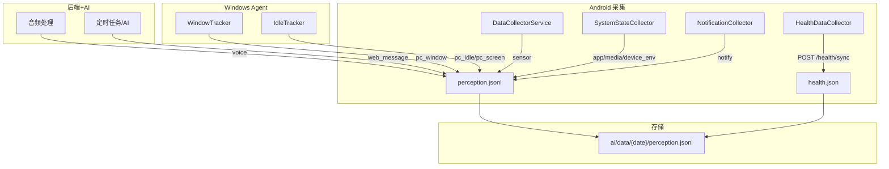

# LiveLog-AI 数据格式

> 基于实际 `perception.jsonl` 数据的完整格式说明

系统将所有数据以 JSON 格式存储在 `ai/data/{YYYY-MM-DD}/` 目录中，按日期组织。

---

## 目录

- [1. 感知数据 (perception.jsonl)](#1-感知数据-perceptionjsonl)
  - [1.1 voice -- 语音事件](#11-voice--语音事件)
  - [1.2 sensor -- 传感器快照](#12-sensor--传感器快照)
  - [1.3 app -- 前台应用切换](#13-app--前台应用切换)
  - [1.4 screen -- 屏幕锁定/解锁](#14-screen--屏幕锁定解锁)
  - [1.5 device_env -- 设备环境](#15-device_env--设备环境)
  - [1.6 media -- 媒体播放状态](#16-media--媒体播放状态)
  - [1.7 pc_window -- Windows 前台窗口](#17-pc_window--windows-前台窗口)
  - [1.8 web_message -- Web/AI 消息](#18-web_message--webai-消息)
  - [1.9 其他事件类型](#19-其他事件类型)
- [2. 健康数据 (health.json)](#2-健康数据-healthjson)
- [3. 健康上传 API](#3-健康上传-api)
- [4. 数据类型汇总](#4-数据类型汇总)

---

## 1. 感知数据 (perception.jsonl)

**路径**: `ai/data/{YYYY-MM-DD}/perception.jsonl`
**格式**: 每行一个 JSON 对象（`\n` 分隔，增量追加）

### 公共字段

所有事件条目都有以下基本字段：

| 字段 | 类型 | 说明 |
|------|------|------|
| `type` | string | 事件类型 |
| `t` | string | 时间 `HH:mm:ss`（北京时间） |
| `t_iso` | string (可选) | ISO 8601 时间戳（PC 事件通常有） |
| `_source` | string (可选) | 数据来源标识（PC 事件为 `"pc_sensor"`） |
| `_agent_id` | string (可选) | 上报 Agent ID（PC 事件） |

---

### 1.1 voice -- 语音事件

由每隔约 1 分钟的音频录制触发。包含 ASR 识别、声纹匹配、情绪分析、场景分类。

```json
{
  "type": "voice",
  "t": "00:00:03",
  "hasSpeech": true,
  "segments": [
    {
      "start": 2.1,
      "end": 4.5,
      "text": "今天天气怎么样",
      "avg_db": -28.5,
      "peak_db": -12.0,
      "db_range": 16.5,
      "zero_crossing_rate": 0.3065,
      "spectral_centroid": 2900.9,
      "voice_ratio": 0.6,
      "silence_ratio": 0.4,
      "speech_prob": 0.852,
      "emotion_tag": "neutral",
      "emotion_prob": 0.64,
      "speaker": "",
      "voiceprint_speaker": "Axeuh",
      "voiceprint_sim": 0.4419,
      "voiceprint_windows": [
        { "start_ms": 0, "score": 0.384, "speaker": "Axeuh" },
        { "start_ms": 1000, "score": 0.3398, "speaker": "Axeuh" }
      ],
      "voiceprint_stats": {
        "min": 0.3398,
        "max": 0.384,
        "avg": 0.3619,
        "user_ratio": 0.0
      }
    }
  ],
  "audio_events": [
    {
      "start": 0.0,
      "end": 3.0,
      "label": "Typing",
      "label_cn": "Typing",
      "probability": 0.71,
      "probability_pct": "71%",
      "count": 2
    }
  ],
  "audio": "2026-06-25/audio/000003_default.wav",
  "scene": "Clicking",
  "asr_text": "今天天气怎么样"
}
```

| 字段 | 类型 | 说明 |
|------|------|------|
| `hasSpeech` | bool | 是否包含人声 |
| `segments` | array | VAD 切分的语音段（见下方） |
| `audio_events` | array | PANNs 音频事件检测（527 类） |
| `audio` | string | 原始音频文件路径（相对于 `backend/data/`） |
| `scene` | string | 场景分类最佳猜测（如 `"Computer keyboard"`、`"Speech"`） |
| `asr_text` | string | 整段音频最佳 ASR 文本摘要 |

**segments[] 字段：**

| 字段 | 类型 | 说明 |
|------|------|------|
| `start` | float | 在 60 秒音频中的起始秒 |
| `end` | float | 结束秒 |
| `text` | string | ASR 识别文本（无语音段为 `"<\|nospeech\|>"`） |
| `avg_db` | float | 平均分贝 |
| `peak_db` | float | 峰值分贝 |
| `db_range` | float | 动态范围 |
| `zero_crossing_rate` | float | 过零率 |
| `spectral_centroid` | float | 频谱质心 (Hz) |
| `voice_ratio` | float | 人声占比 (0~1) |
| `silence_ratio` | float | 静音占比 (0~1) |
| `speech_prob` | float | PANNs 判断为人声的概率 |
| `emotion_tag` | string | 情绪标签，取值: `neutral`, `happy`, `sad`, `angry`, `fearful`, `disgusted`, `surprised`, `other` |
| `emotion_prob` | float | 情绪置信度 (0~1) |
| `speaker` | string/int | 说话人标签（空字符串或聚类标签数字 0,1,2...） |
| `voiceprint_speaker` | string | 声纹匹配结果（如 `"Axeuh"`，仅匹配到时有值） |
| `voiceprint_sim` | float | 声纹相似度 (0~1) |
| `voiceprint_windows` | array (可选) | 声纹滑窗详细评分 |
| `voiceprint_stats` | object (可选) | 声纹滑窗统计 |

**voiceprint_windows[] 字段：**

| 字段 | 类型 | 说明 |
|------|------|------|
| `start_ms` | int | 滑窗起始毫秒 |
| `score` | float | 该窗相似度 |
| `speaker` | string | 匹配到的人名 |

**voiceprint_stats 字段：**

| 字段 | 类型 | 说明 |
|------|------|------|
| `min` | float | 滑窗最小相似度 |
| `max` | float | 滑窗最大相似度 |
| `avg` | float | 滑窗平均相似度 |
| `user_ratio` | float | 判定为用户的窗口占比 |

**audio_events[] 字段：**

| 字段 | 类型 | 说明 |
|------|------|------|
| `start` | float | 事件起始秒 |
| `end` | float | 事件结束秒 |
| `label` | string | 事件英文标签 |
| `label_cn` | string | 事件中文标签（部分有中文翻译） |
| `probability` | float | 置信度 (0~1) |
| `probability_pct` | string | 百分比字符串如 `"71%"` |
| `count` | int | 该标签在 1 秒帧中出现的帧数 |

**声纹置信度参考：**

| 相似度范围 | 含义 |
|:----------:|------|
| > 0.5 | 用户本人清晰说话 |
| 0.3~0.5 | 用户日常对话范围 |
| < 0.3 | 环境音/他人声音 |
| `user_ratio` | 有滑窗时优先于单条 sim 值 |

---

### 1.2 sensor -- 传感器快照

由 Android 每分钟采集。所有字段扁平，无 `payload` 嵌套。

```json
{
  "type": "sensor",
  "t": "00:00:18",
  "gps": "31.95257325,119.81583889",
  "phone_battery": 89
}
```

| 字段 | 类型 | 说明 |
|------|------|------|
| `gps` | string (可选) | `"latitude,longitude"` 字符串 |
| `phone_battery` | int (可选) | 手机电量百分比 0-100 |
| `hr` | int (可选) | 心率（来自手机传感器快照） |
| `steps` | int (可选) | 步数 |

> **注意**：GPS 在后台可能被系统抑制，长时间不变不代表位置没变。

---

### 1.3 app -- 前台应用切换

```json
{
  "type": "app",
  "t": "00:16:14",
  "app": "扇贝单词英语版"
}
```

| 字段 | 类型 | 说明 |
|------|------|------|
| `app` | string | 前台应用名称 |

---

### 1.4 screen -- 屏幕锁定/解锁

```json
{
  "type": "screen",
  "t": "00:16:40",
  "locked": true
}
```

| 字段 | 类型 | 说明 |
|------|------|------|
| `locked` | bool | 屏幕是否锁定 |

---

### 1.5 device_env -- 设备环境

```json
{
  "type": "device_env",
  "t": "00:16:09",
  "screen": { "locked": false }
}
```

device_env 可能包含以下子对象（按实际情况出现，非全部同时存在）：

- `screen`: `{ "locked": true/false }` -- 屏幕锁状态
- `wifi`: `{ "ssid": "MyWiFi", "rssi": -65, "linkSpeed": 866, "connected": true }` -- WiFi 信息
- `bluetooth`: `[{ "name": "Hand Ring", "address": "AA:BB:CC:DD:EE:FF", "profile": 1 }]` -- 蓝牙设备列表
- `network`: `{ "type": "wifi", "mobileData": false }` -- 网络类型

---

### 1.6 media -- 媒体播放状态

```json
{
  "type": "media",
  "t": "00:31:17",
  "media_app": "网易云音乐",
  "media_title": "Meows and Purrs (Quilts and Cats of Calico Original Video Game Soundtrack)",
  "media_artist": "Paweł Górniak",
  "media_duration": 249000,
  "media_state": "playing"
}
```

| 字段 | 类型 | 说明 |
|------|------|------|
| `media_app` | string | 播放器应用名 |
| `media_title` | string | 歌曲/媒体标题 |
| `media_artist` | string | 艺术家 |
| `media_duration` | int | 总时长（毫秒） |
| `media_state` | string | 播放状态: `playing` / `paused` / `buffering` / `stopped` / `skipping` |

---

### 1.7 pc_window -- Windows 前台窗口

由 Windows Agent 上报，均有 `_source: "pc_sensor"` 和 `_agent_id` 字段。

```json
{
  "type": "pc_window",
  "t": "00:09:47",
  "t_iso": "2026-06-25T00:09:47.696084+08:00",
  "payload": {
    "process": "Weixin.exe",
    "title": "微信",
    "pid": 58556
  },
  "_source": "pc_sensor",
  "_agent_id": "default-agent"
}
```

| 字段 | 类型 | 说明 |
|------|------|------|
| `payload.process` | string | 进程名称 |
| `payload.title` | string | 窗口标题 |
| `payload.pid` | int | 进程 ID |

---

### 1.8 web_message -- Web/AI 消息

由后端或 AI 系统写入的消息事件。

```json
{
  "type": "web_message",
  "t": "00:00:00",
  "content": "[任务触发] 数据检查_00点",
  "source": "task_trigger",
  "user_qq": "default"
}
```

| 字段 | 类型 | 说明 |
|------|------|------|
| `content` | string | 消息内容 |
| `source` | string | 消息来源，如 `"task_trigger"`, `"web_message"` |
| `user_qq` | string (可选) | 用户标识 |

文件上传示例：

```json
{
  "type": "web_message",
  "t": "00:20:08",
  "content": "[用户上传了 1 个文件:]\n- D:/path/to/file.jpg\n(无文字)",
  "source": "web_message"
}
```

---

### 1.9 其他事件类型

以下事件类型在实际数据中较少出现，此处列出可能的结构：

**notify -- 通知事件**：

```json
{
  "type": "notify",
  "t": "14:30:25",
  "payload": {
    "app": "微信",
    "count": 3
  }
}
```

**pc_idle -- PC 空闲状态**：

```json
{ "type": "pc_idle", "t": "14:30:25", "payload": { "state": "idle", "idle_seconds": 345 } }
{ "type": "pc_idle", "t": "14:30:25", "payload": { "state": "active", "idle_seconds": 0 } }
```

**pc_screen -- PC 屏幕锁定**：

```json
{ "type": "pc_screen", "t": "14:30:25", "payload": { "state": "lock" } }
```

---

## 2. 健康数据 (health.json)

**路径**: `ai/data/{YYYY-MM-DD}/health.json`
**格式**: 单 JSON 对象，每天一条，由后端在健康数据同步时生成/更新。

```json
{
  "date": "2026-06-25",
  "updated_at": "2026-06-25T15:16:58.237855+08:00",
  "samples": [
    {
      "t": 1782316800,
      "t_iso": "2026-06-25 00:00:00",
      "hr": 76
    }
  ]
}
```

### samples 字段说明

| 字段 | 类型 | 说明 |
|------|------|------|
| `t` | int | Unix 时间戳（秒） |
| `t_iso` | string | 可读时间（自动添加） |
| `hr` | int | 心率 0-250 |
| `steps` | int (可选) | 步数（累积值） |
| `stress` | int (可选) | 压力 0-255 |
| `spo2` | int (可选) | 血氧 0-100 |
| `battery` | int (可选) | 电量 0-100 |

### daily_summary 字段说明

```json
{
  "daily_summary": {
    "steps": 8542,
    "hr_resting": 62,
    "hr_avg": 78,
    "hr_max": 145,
    "hr_min": 58,
    "stress_avg": 28,
    "spo2_avg": 97,
    "calories": 1850,
    "training_load": 120
  }
}
```

| 字段 | 类型 | 说明 |
|------|------|------|
| `steps` | int | 总步数 |
| `hr_resting` | int | 静息心率（当日最低） |
| `hr_avg` | int | 平均心率 |
| `hr_max` / `hr_min` | int | 最高/最小心率 |
| `stress_avg` | int | 平均压力 |
| `spo2_avg` | int | 平均血氧 |
| `calories` | int | 卡路里 |
| `training_load` | int | 训练负荷 |

### sleep_data 字段说明

```json
{
  "sleep_data": {
    "duration_min": 450,
    "deep_min": 120,
    "light_min": 210,
    "rem_min": 90,
    "awake_min": 30,
    "wakeup_time": 1719264000,
    "stages": [
      { "t": "23:00", "stage": "deep" },
      { "t": "00:30", "stage": "light" },
      { "t": "02:00", "stage": "rem" },
      { "t": "06:30", "stage": "light" }
    ]
  }
}
```

| 字段 | 类型 | 说明 |
|------|------|------|
| `duration_min` | int | 总睡眠分钟数 |
| `deep_min` / `light_min` / `rem_min` / `awake_min` | int | 各阶段分钟 |
| `wakeup_time` | int | 起床 Unix 时间戳 |
| `stages` | array | 阶段时间线 `{t: "HH:mm", stage: "deep"}` |

`stage` 取值: `"deep"` / `"light"` / `"rem"` / `"awake"`（也兼容旧版数字 1-5）

---

## 3. 健康上传 API

### POST /api/health/sync

请求体：

```json
{
  "samples": [
    { "t": 1719300000, "hr": 72, "steps": 1245, "stress": 25, "spo2": 98 }
  ],
  "daily_summary": { "steps": 8542, "hr_resting": 62 },
  "battery_levels": [ { "t": 1719300000, "level": 85 } ],
  "sleep_data": { "duration_min": 450, "stages": [...] },
  "client_time": "2026-06-25T14:30:25+08:00"
}
```

响应：

```json
{
  "status": "ok",
  "dates": ["2026-06-25"],
  "stats": {
    "samples": 12,
    "dates_updated": ["2026-06-25"]
  }
}
```

### POST /api/health/upload-db

上传 Gadgetbridge SQLite 数据库文件（multipart/form-data），后端解析 `XIAOMI_ACTIVITY_SAMPLE` 和 `XIAOMI_SLEEP_TIME_SAMPLE` 表，重新生成所有日期的 health.json。

### GET /api/health/query?date=YYYY-MM-DD

返回指定日期的 health.json 完整内容。

### GET /api/health/dates

```json
["2026-06-25", "2026-06-24", "2026-06-23"]
```

---

## 4. 数据类型汇总



所有数据均在 `ai/data/{YYYY-MM-DD}/` 目录下按日期组织。AI 分析系统以此为基础进行数据检查和报告生成。
